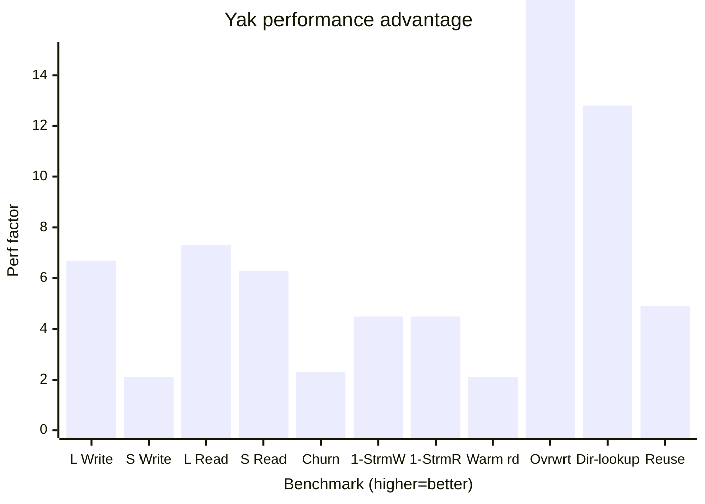

# Yak performance
A [small test project compares Yak performance](https://github.com/sunbeam60/yak-cfb-compare) against [rust-cfb](https://github.com/mdsteele/rust-cfb), its spiritual relative.

 The benchmarks chosen may not match users' scenario so conclusions should not be drawn based on these results alone. Instead callers should compare alternatives up against their own requirements and choose the one that suits them best.
 
 The benchmarks here favour Yak. Undoubtedly other benchmarks could be chosen that do not favour Yak, but I have tried to choose a typical set of scenarios that users of Yak and rust-cfb may need. All libraries that handle Compound File Binary files are tied to the specification of CFB and this specification, essentially "FAT in a file", guides decisions and performance characteristics of those libraries. Undoubtedly, seasoned CFB library maintainers, if no longer constrained by the CFB spec, could write something significantly higher performing than Yak (from the experience they've acquired having to support CFB). Lastly, Yak may have bugs on account of Yak's performance and, should those bugs be fixed, Yak's performance may slow. Performance can often be traded with memory; Yak's memory consumption may be higher than other libraries (this has not been measured). These benchmarks were run on hardware the author had to hand. Other hardware may produce different results and different conclusions. There may be configuration options in rust-cfb that alter its performance, which have not been discovered by the author of Yak. 

 In summary: These benchmarks aren't necessarily fair.

 There are many reasons to use rust-cfb, not least if you have to open or create CFB files.

 ## Setup
 - Setup 1: Windows 11 Pro (64bit) 25H2 (build 26200.7921), AMD Ryzen 7 7800X3D CPU, 64 GB DDR5 RAM, Samsung SSD 970 EVO
 - Setup 2: MacOS 26.1 (build 25B78), MacBook Pro, Apple M3 CPU, 16 GB RAM

Both machines built the benchmark using Yak 0.11.1 and rust-cfb 0.14.0. The benchmark command was 
```ASCII
yak-cfb-compare all --repeat 3
```

## Results
Yak is **7 times** more performant than rust-cfb, in uncompressed & unencrypted mode. rust-cfb does not support compression and encryption so this cannot be tested.



| Benchmark             | Setup 1: Yak (ms) | Setup 2: Yak (ms) | Setup 1: rust-cfb (ms) | Setup 2: rust-cfb (ms) | Remarks                                                       | Average Factor |
| --------------------- | ----------------- | ----------------- | ---------------------- | ---------------------- | ------------------------------------------------------------- | -------------- |
| Large Write           | 87                | 49                | 685                    | 268                    | Write 5 streams of 30 MB                                      | 6.7x           |
| Small Write           | 31                | 15                | 74                     | 26                     | Write 180 streams of 10 KB                                    | 2.1x           |
| Large Read            | 101               | 66                | 1049                   | 283                    | Read 17 streams of 10 MB & 17 streams of 20 MB                | 7.3x           |
| Small Read            | 53                | 17                | 392                    | 87                     | Read 2750 streams of 10 KB                                    | 6.3x           |
| Churn                 | 121               | 38                | 256                    | 98                     | Write 20 streams of 512 KB then delete, 5 times               | 2.3x           |
| Single Stream (Write) | 110               | 20                | 331                    | 118                    | Write 1 stream of 64 MB                                       | 4.5x           |
| Single Stream (Read)  | 20                | 17                | 147                    | 29                     | Read 1 stream of 64 MB                                        | 4.5x           |
| Warm Read             | 41                | 17                | 81                     | 38                     | Write then read 2750 streams of 10KB                          | 2.1x           |
| Overwrite             | 34                | 14                | 633                    | 333                    | Write 10MB then 5000 scattered overwrites                     | 21.2x          |
| Directory Lookups     | 31                | 13                | 509                    | 120                    | Scattered lookup of 4000 streams in directory of 4000 streams | 12.8x          |
| Reuse (fresh)         | 7                 | 2                 | 44                     | 7                      | Read throughput of 1000 512 blocks from fresh blocks          | 4.9x           |
| Reuse (recycled)      | 3                 | 2                 | 44                     | 7                      | Read throughput of 1000 512 blocks from re-used blocks        | 9.1x           |
| **Total**             | **639**           | **270**           | **4245**               | **1414**               | **Average**                                                   | **7.0x**       |

There are many ways of calculating the results. Here is shown the average of how Yak compared against rust-cfb in each benchmark, on the same system, which removes the weight of longer running benchmarks against shorter running benchmarks; in effect it makes every benchmark equally important. Users should draw their own conclusion depending on their specific needs.

## Observations
- Yak benefits from its ability to arrange same-stream blocks contiguously. Overall, longer reads/writes (benchmark: Large Write, Large Read) outperform rust-cfb more than short reads/writes (benchmark: Small Write, Small Read), though anything that spans multiple blocks tend to favour Yak. When Yak discovers contiguous blocks for a file, it can minimize IO reads/writes.
- CFB files use FAT internally and FAT links blocks together as a linked list. This makes seeks in files very expensive (benchmark: Overwrite), O(N) in rust-cfb, and comparatively cheap in Yak, O(log N), due to Yak using a pyramid tree structure.
- Yak makes heavier use of caching, which consumes memory, than rust-cfb (benchmark: Directory Lookups). Some lookups are therefore significantly faster than rust-cfb. Both benefit from the OS virtual memory system, though, when reading directly from the file near where they've already read.
- Multi-threaded scenarios (threaded-read, threaded-write, threaded-mix) could not be tested across both systems, as rust-cfb is not thread-safe.
